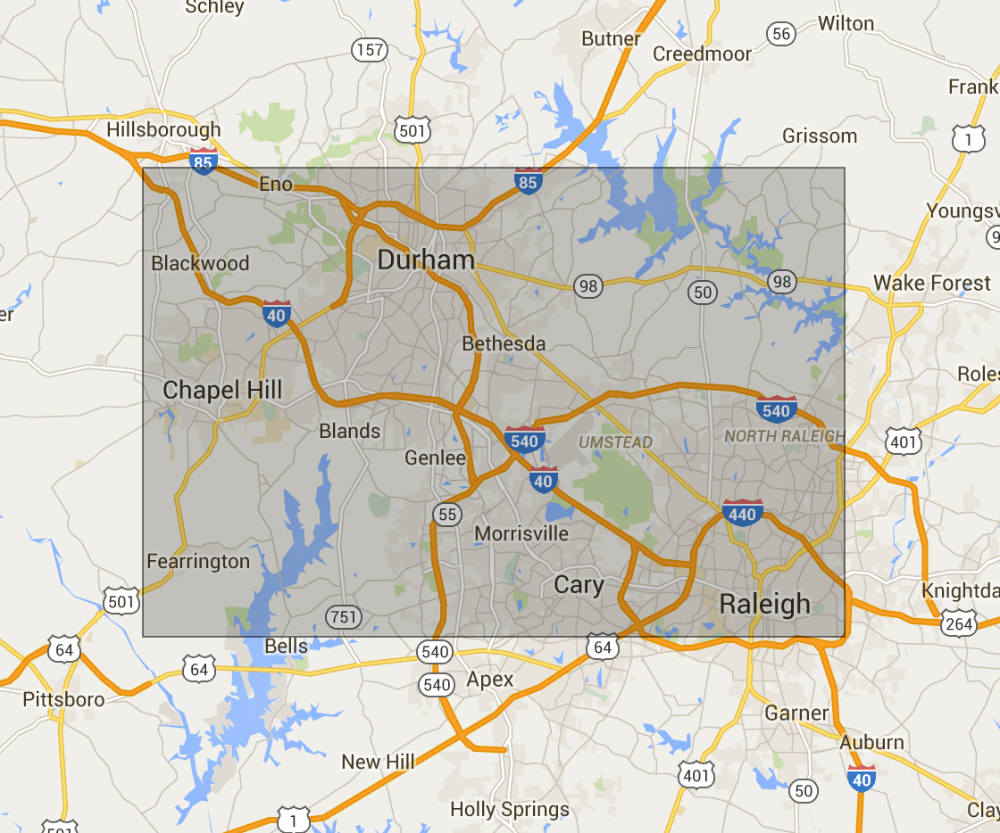

# Udacity Data Analysis Nanodegree - Data Wrangling Project 

### Overview
This project is an exercise in extracting data from an open source map project, assessing the validity of the data, cleaning the data and loading the data into a MongoDB database.  

The map area is the Triangle region of central North Carolina.  This area encompasses the three major cities of Raleigh, Durham and Chapel Hill and is home to technology hub Research Triangle Park.

I downloaded the data for the project from [Mapzen's](https://mapzen.com/data/metro-extracts) pre-defined Raleigh, North Carolina metropolitan area.  

### Project Files

* "data wrangling project writeup.pdf" - the pdf document containing my responses to the rubric questions

* "Data Wrangling Project - Raleigh Map data.ipynb" - the python notebook containing the code that I used to audit and clean the dataset, including the code for the lesson 6 quizzes

* "data wrangling project references.txt" - the resources used in this project

* sample.osm - a sample of the OSM file used in this project

* raleigh_map.html - the code used to make a visualization of the Raleigh metropolitan area bounds
